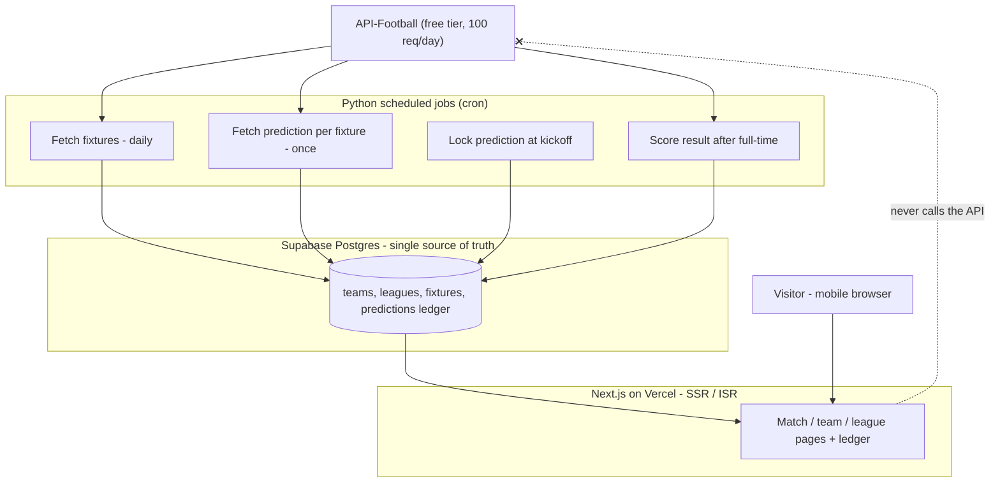

# ARCHITECTURE.md — Football Analysis Site

> **What this is:** the single source of truth for this project. Keep it in the repo root. At the start of every Claude Code session, tell Claude Code to **read this file first**. Build in the order set out in Section 14 (Build plan). Do not let the build drift from the invariants in Section 13.

---

## 0. How to use this document with AI

- This file is the spec. Claude Code reads it; you verify the things flagged **[VERIFY YOURSELF]** (the scoring maths, database access rules, secret handling, and the legal/disclaimer text).
- Everything buildable is built by Claude Code via prompts. Account creation, payments, secrets, and DNS are done by **you** (an AI cannot and should not do these).
- Golden rule that the whole project depends on: **the scheduled jobs talk to the football API; the website only ever talks to our own database.** Never call the API per visitor.

---

## 1. Product overview & vision

A free, mobile-first **football analysis** website. For each match it shows home/draw/away probabilities, a predicted score, recent form, and a short plain-language read of the matchup — framed as **analysis and probability, not a guarantee and not regulated betting advice**.

The identity and the moat is **radical transparency**: a permanent, public **prediction ledger**. Every prediction is timestamped, **locked at kickoff**, scored properly after full-time (Brier score, log loss, calibration), and the misses stay visible forever. Almost every tipster site hides its losses and makes unverifiable claims; a verifiable, losses-visible record is the one thing that separates this product from that crowd — and, in practice, it is also the best protection against the misleading-claims rules that get tipster businesses fined and banned.

Launches around the 2026 World Cup knockouts on a **league-agnostic** design, then carries into club football (Premier League, Champions League), where continuous fixtures give better data and retention. Free at launch; a premium tier is designed to slot in **later**, once the public track record is large enough to be persuasive.

---

## 2. Target users & primary journeys

**Sharpest early user:** an engaged football fan who follows odds/predictions and is sceptical of tipsters — someone who will reward a site that *proves* its record instead of asserting it.

**Primary journeys**
1. *Match check:* lands on a match page (often from search) → sees H/D/A %, predicted score, form, the written read, and the disclaimer → optionally clicks through to the ledger to verify the record.
2. *Trust check:* lands on the ledger/track-record page → sees the running record including losses, Brier/calibration, and a sample-size note → trusts (or doesn't) and explores match pages.
3. *Browse:* league or team page → upcoming fixtures with quick probabilities → individual match pages.

---

## 3. Goals & non-goals (v1)

**Goals**
- Ship a fast, mobile-first, server-rendered site on our own domain.
- Per-match pages with H/D/A %, predicted score, form, and a written read.
- A locked, immutable, publicly visible prediction ledger that scores wins **and** losses.
- A page-per-match/team/league structure built for organic search (the growth engine).
- Architecture that makes a premium gate and ad slots a later toggle, not a rewrite.

**Non-goals (v1)**
- No user accounts, logins, or any personal data (deferred to v2).
- No payments, paywall, or ads switched on yet (built ready, not live).
- No odds comparison, no affiliate or "bet now" links, anywhere in the product.
- No in-house model beyond a simple Elo logged for later comparison.
- No team crests, player photos, or official tournament marks.

---

## 4. Feature scope

| Area | v1 (must-have) | v2 (deferred) |
|---|---|---|
| Match page | H/D/A %, predicted score, form (last N), written read, disclaimer | xG breakdowns, head-to-head deep dive |
| Ledger | Locked + immutable; running record incl. losses; Brier/log loss; sample-size note | Filters by league/market; downloadable CSV; calibration charts |
| Predictions | API-Football prediction per fixture (labelled third-party) + in-house Elo logged silently | In-house model promoted to primary if it beats baseline on the ledger |
| Content surface | Pages per match, team, league (SSR/SSG) | Editorial pieces, previews, programmatic round-ups |
| Growth | SEO-first routing, sitemap, metadata | Email capture → newsletter; social cards |
| Monetisation | **Ready, not on:** `tier` field in content model; reserved ad slots | Premium gate on deeper analysis; vetted payment processor; ads (own domain + approval) |
| Accounts | None | Email capture, then accounts + saved preferences |

---

## 5. System architecture

**Request flow:** visitor → Vercel edge/CDN → server-rendered (or pre-rendered/ISR) page → reads from Supabase → HTML. No third-party API call is ever triggered by a visitor.

**Data flow:** API-Football → Python jobs → Supabase (write) → Next.js (read) → visitor.

**Main services:** API-Football (data), Supabase (Postgres + auth-ready), Vercel (web hosting + cron or an external scheduler), Sentry (errors), Plausible or GA4 (analytics).

**Failure points & handling**
- *API down / rate-limited:* jobs retry with backoff; site is unaffected because it serves from the DB. Stale data is fine; missing data hides the prediction, never blocks the page.
- *Job fails to lock before kickoff:* a prediction that wasn't locked in time is marked `unlocked_void` and **excluded** from the scored record (integrity over coverage).
- *Bad/partial fetch:* writes are idempotent (keyed on fixture id); re-running a job is safe.

---

## 6. Tech stack & rationale

| Layer | Choice | Why |
|---|---|---|
| Web app | **Next.js (App Router) + TypeScript + Tailwind**, plus **shadcn/ui** for accessible interactive primitives (scoped — see note below) | Best-in-class server rendering for SEO (the growth engine), strong Claude Code support, large ecosystem |
| Hosting | **Vercel** (free tier) | Zero-config Next.js deploys, CDN, preview deploys; fits the budget |
| Database | **Supabase Postgres** (free tier) | Managed Postgres, Row Level Security, generous free tier, manageable by Claude Code via the Supabase MCP |
| Jobs / model / scoring | **Python** (scheduled) | Where you're comfortable and where the scoring maths must be hand-verified; runs as cron (Vercel Cron, GitHub Actions, or Supabase scheduled functions) |
| Errors | **Sentry** | Catches runtime errors early |
| Analytics | **Plausible** (or GA4) | Lightweight, privacy-friendly; no cookie banner if cookieless |

**UI components — shadcn/ui, scoped (decided 2026-06-18).** shadcn/ui (Radix + Tailwind, copy-in — components live in our repo, not a runtime dependency) is the sanctioned source for **accessible interactive primitives only**: Dialog, Dropdown, Popover, Tabs, Combobox, Toast, and similar. Presentational / content components (MatchCard, ProbabilityBar, tables, badges) stay **hand-built RSC + Tailwind** to honour DESIGN.md's "ship minimal client JS" goal. Every shadcn component is restyled to the DESIGN.md tokens — never its default theme. Rationale: Radix owns the hard accessibility (focus management, ARIA, keyboard nav) so it doesn't rot in bespoke code, while scoping it to interactive bits keeps the static, SEO-driven surface zero-client-JS.

**Key decoupling:** the Python layer and the web layer meet **only at the database**. That means the web-framework choice is far less locking than it looks, and you keep the maths in Python regardless. If you later prefer an all-Python web layer (Django + HTMX), the data layer is unaffected.

---

## 7. Data model / database schema

Tables (Postgres). Times are `timestamptz` in UTC.

**`leagues`** — `id`, `api_league_id`, `name`, `slug`, `country`, `season`.

**`teams`** — `id`, `api_team_id`, `name` (plain text, no crest), `slug`, `league_id`.

**`fixtures`** — `id`, `api_fixture_id` (unique), `league_id`, `home_team_id`, `away_team_id`, `kickoff_utc`, `status` (`scheduled`/`live`/`finished`/`postponed`), `final_home_goals` (nullable), `final_away_goals` (nullable), `created_at`, `updated_at`.

**`predictions`** — *the ledger; this is the product.*

| Column | Type | Notes |
|---|---|---|
| `id` | uuid PK | |
| `fixture_id` | FK → fixtures | one row per fixture per model_version |
| `model_version` | text | e.g. `api-football-v1`, `elo-v1` |
| `source` | text | `api-football` or `inhouse-elo` |
| `prob_home` / `prob_draw` / `prob_away` | numeric | must sum to ~1.0 (CHECK) |
| `predicted_home_goals` / `predicted_away_goals` | int | the predicted scoreline |
| `published_at` | timestamptz | when we created the prediction |
| `locked_at` | timestamptz | = kickoff; after this the row is immutable |
| `status` | text | `published` / `locked` / `scored` / `unlocked_void` |
| `final_home_goals` / `final_away_goals` | int, nullable | copied from fixture at scoring |
| `result` | text, nullable | `home` / `draw` / `away` |
| `brier_score` | numeric, nullable | computed at scoring (Section 10) |
| `log_loss` | numeric, nullable | computed at scoring (Section 10) |
| `scored_at` | timestamptz, nullable | |
| `created_at` | timestamptz | default now() |

**Integrity rules [VERIFY YOURSELF]**
- A `CHECK` that `prob_home + prob_draw + prob_away` is within a small epsilon of 1.0.
- A **trigger** that rejects any `UPDATE` to `prob_*`, `predicted_*`, `model_version`, `source`, or `published_at` once `locked_at <= now()`. Scoring fields (`final_*`, `result`, `brier_score`, `log_loss`, `scored_at`, `status`) may still be written by the scoring job.
- **Row Level Security:** the public/anon role is **read-only**; only the service role (used by the Python jobs via the secret key) may write. The website uses the **publishable key** (`NEXT_PUBLIC_SUPABASE_PUBLISHABLE_KEY`, `sb_publishable_…`); the jobs use the **secret key** (`SUPABASE_SECRET_KEY`, `sb_secret_…`, kept server-side only).

---

## 8. External data sources & integration

**Primary (v1): API-Football (free tier, 100 requests/day).**

| Endpoint | Use | Frequency |
|---|---|---|
| `/fixtures` | upcoming + finished fixtures for tracked leagues | once or twice daily |
| `/predictions?fixture={id}` | third-party probabilities + predicted score | **once per fixture**, then cached forever |
| `/teams`, `/standings` | team names, form context | low; cache aggressively |
| `/fixtures` (status poll) | detect full-time to trigger scoring | a few times around match end |

**Rate-limit / caching strategy (staying under 100/day)**
- Fetch each fixture's prediction **exactly once** and store it; never re-fetch.
- One daily fixtures sweep per tracked league. Knockout days have few matches; even a full Premier League round (10 matches) costs ~10 prediction calls.
- All reads on the site come from Postgres. The 100/day budget is comfortable.

**Scheduled jobs**
1. *Fetch fixtures* (daily): upsert upcoming fixtures keyed on `api_fixture_id`.
2. *Fetch predictions* (daily): for upcoming fixtures without a prediction, fetch once, compute and store the in-house Elo alongside, set `status='published'`.
3. *Lock* (frequent, e.g. every 10–15 min): set `status='locked'` for predictions whose `locked_at <= now()`; mark any still-unpublished-at-kickoff fixtures `unlocked_void`.
4. *Score* (frequent around match end): when a fixture is finished, copy the final score, set `result`, compute `brier_score` and `log_loss`, set `status='scored'`, `scored_at=now()`.

**Fallback / club-football plan:** add **football-data.org** for Premier League / Champions League continuity after the World Cup. Same fetch→store→serve pattern; just another source feeding the same tables.

---

## 9. Prediction methodology & labelling rules

- **v1 source:** API-Football's `/predictions` output, **clearly labelled on every match page as a third-party model** — "probabilities from a third-party model; context, not a guarantee."
- **In-house Elo (logged, not shown):** a simple team-rating Elo updated after results, stored with `model_version='elo-v1'`. It runs silently in the ledger so that, over time, you can compare it to the third-party baseline and promote it only if it earns its place on the scored record.
- **Labelling / disclaimer language (use verbatim, surfaced on every prediction):**
  - *"Analysis and probabilities only — not betting advice. Outcomes are uncertain; we do not guarantee results and we do not claim to beat the market."*
  - *"18+. Please gamble responsibly."* with a link to the current National Gambling Helpline / GamCare and GAMSTOP. **[VERIFY YOURSELF — confirm the current official UK support resources at build time; the support landscape is changing under the new statutory levy.]**
- **Never** present a prediction as a tip you guarantee, never imply it solves money problems, never claim an edge over bookmakers.

---

## 10. Accuracy ledger design

**Locking & immutability:** see Section 7. Predictions lock at kickoff and cannot be altered afterwards; only scoring fields are written post-match. Predictions not locked before kickoff are voided and excluded from the scored record.

**Scoring (computed by the Python job) [VERIFY YOURSELF]**

For one match with predicted probabilities `p_home, p_draw, p_away` and the actual outcome encoded as `(y_home, y_draw, y_away)` where the true outcome is 1 and the others 0:

- **Brier score** (multiclass, per match):
  `BS = (p_home − y_home)² + (p_draw − y_draw)² + (p_away − y_away)²`
  Range 0 (perfect) to 2 (confidently wrong). Report the mean over all scored predictions.

- **Log loss** (per match):
  `LL = −ln(p_correct)`, where `p_correct` is the probability assigned to the outcome that happened. Clip probabilities to `[ε, 1−ε]` (e.g. ε = 1e-12) so it never blows up. Report the mean. Punishes confident wrong calls hard.

- **Calibration:** bucket predictions by predicted probability (e.g. 0–10%, 10–20%, …) and compare predicted probability to the observed frequency in each bucket; render as a reliability table/diagram.

**Display of wins and losses**
- Show the running record including losses, plus mean Brier and mean log loss.
- Always show **sample size** and a confidence note: small samples are noisy; the numbers only mean something over dozens-to-hundreds of scored predictions. State this plainly so the record is honest about its own limits.

---

## 11. Pages, routes & sitemap

| Route | Purpose | Rendering |
|---|---|---|
| `/` | Home: featured upcoming matches, link to ledger | SSG/ISR |
| `/match/[id]` | Match page: H/D/A %, predicted score, form, written read, disclaimer | SSR or ISR |
| `/team/[slug]` | Team page: upcoming + recent fixtures, form | ISR |
| `/league/[slug]` | League page: fixtures list | ISR |
| `/ledger` (or `/track-record`) | Full public record incl. losses, Brier, calibration, sample size | ISR |
| `/about` | What this is, methodology, the "analysis not advice" positioning | static |
| `/responsible-gambling` | 18+, signposting to support resources | static |
| `/sitemap.xml`, `/robots.txt` | SEO | generated |

**SEO notes:** server-render everything that should rank; per-match/team/league pages create thousands of indexable URLs (the growth engine). Unique title + meta description per page; structured metadata; clean slugs; generated sitemap. Use ISR so pages stay fresh without per-request API calls.

---

## 12. Non-functional requirements

- **Mobile-first:** designed for phones first; Tailwind responsive utilities.
- **SEO:** SSR/SSG/ISR, semantic HTML, fast Core Web Vitals, sitemap, per-page metadata.
- **Performance:** served from CDN + DB cache; no blocking third-party calls on the request path.
- **Security [VERIFY YOURSELF]:** secrets only in environment variables (Supabase **secret key** `SUPABASE_SECRET_KEY` and API-Football key **never** in the client bundle or the repo); RLS read-only for the public role; `.env*` git-ignored.
- **Monitoring:** Sentry on web and jobs.
- **Analytics:** Plausible (cookieless → no cookie banner needed) or GA4.
- **Accessibility:** sufficient colour contrast, keyboard navigation, alt text, sensible headings.

---

## 13. Legal & compliance guardrails

**Positioning:** this is a **football analysis** product. Probabilities are analysis/context, never guarantees; it is **not** regulated financial/betting advice and **not** a gambling operator (we never take, hold, route, or facilitate bets, so no Gambling Commission operating licence is required — confirm with a professional before any monetisation). **[VERIFY YOURSELF with proper legal sign-off before charging money or running ads.]**

**Disclaimer placement:** the "analysis, not betting advice / 18+ / gamble responsibly" line appears on **every** match and prediction view, in the global footer, and as dedicated `/about` and `/responsible-gambling` pages. Bake it into the base layout so it is present by default, never bolted on.

**Marketing rules (for when you promote it):** nothing may have strong appeal to under-18s; never imply betting solves money problems or guarantees gains; every performance claim must be true and provable (the ledger is exactly this). The transparency record is your compliance asset — use it instead of hype.

**IP rules:** plain-text team names only. **No** team crests, player photographs, club badges, or official tournament marks (e.g. World Cup logos). Original design only.

**Data / privacy:** v1 holds **no personal data** and uses **no personal-data scraping** (no social-media monitoring of players or anyone else — public ≠ free to process). Football data comes from licensed providers. **If accounts are added later:** publish a privacy notice, register with the ICO if required, capture only what's needed, support access/deletion requests, and use a lawful basis for any email marketing.

**Monetisation guardrails:** premium is built ready but off until there's a credible record; any payment processor must be vetted up front (gambling-adjacent businesses are often treated as high-risk); ads require your **own domain** + network approval; affiliate/"bet now" links stay **out** of the product.

---

## 14. Build plan / milestones

Sequenced for AI-assisted building. "Day" = a focused working session; push harder this week if you want the site live faster. Remember the **track record is calendar time**, not build time.

**Day 1 — Foundations (today).** Buy domain; create accounts (GitHub, Vercel, Supabase, API-Football); install Node LTS; scaffold the Next.js + TS + Tailwind app; create the Supabase schema (incl. the ledger table + immutability trigger + RLS); deploy a skeleton to Vercel on your domain.

**Days 2–3 — Data pipeline (prototype).** Python jobs: fetch fixtures → store; fetch one prediction per fixture → store; compute + store Elo alongside. Verify rows land correctly and the rate budget holds. A match page renders real probabilities from the DB.

**Days 4–7 — Read-only launch.** Match/team/league pages; the locked ledger view; lock + score jobs running on a schedule; disclaimers and responsible-gambling pages live; SEO basics (metadata, sitemap, robots). Site is publicly usable on your domain.

**Days 8–14 — MVP polish.** Written match read (template-driven); calibration/sample-size display; Sentry + analytics; mobile + accessibility pass; reserve ad slots and add the `tier` field (monetisation-ready). Begin accumulating locked, scored predictions.

**~Day 30+ — Credible product.** Enough scored predictions for the record to mean something; add football-data.org for club football; capture emails to bridge into the club-football phase. Only now consider switching on monetisation, with legal sign-off.

---

## 15. Risks & mitigations

| Risk | Mitigation |
|---|---|
| Track record needs months to be persuasive | Launch free; treat the record as a slow asset; be honest about sample size |
| World Cup window is short | League-agnostic design; the real horizon is club football |
| Misleading-claims / advertising rules | The transparency ledger *is* the compliant marketing; never hype or guarantee |
| Payment processors treat you as high-risk | Don't build the paywall first; vet a processor before charging |
| Ad networks restrict betting-tips content | Own domain from day one; defer ads; neutral branding |
| API rate limit / outage | Fetch-once + cache; site serves from DB; idempotent retries |
| Ledger integrity bug | Immutability trigger + RLS + void-if-unlocked; verify the maths yourself |
| Solo founder bandwidth (~10 hrs/wk) | AI does the building; you verify maths/secrets/legal; ship read-only first |

---

## 16. Open questions / deferred decisions

- Brand name and exact domain (your call — keep it neutral, not "tips/bet/odds").
- Scheduler: Vercel Cron vs GitHub Actions vs Supabase scheduled functions (decide at Day 2).
- Premium pricing and which fields are gated (defer until there's a record).
- Whether the in-house Elo ever becomes primary (decided *by the ledger*).
- Exact current responsible-gambling resources to link (verify at build time).

---

## 17. Glossary

- **Brier score** — mean squared error between predicted probabilities and actual outcomes; 0 is perfect, lower is better.
- **Log loss** — penalises confident wrong predictions using the log of the probability assigned to the true outcome; lower is better.
- **Calibration** — whether predicted probabilities match observed frequencies (do "70%" calls happen ~70% of the time?).
- **Closing-line value (CLV)** — how your number compares to the market's final price; a common (here, internal-only) yardstick.
- **xG (expected goals)** — model estimate of how many goals a chance/team "should" have scored, given chance quality.
